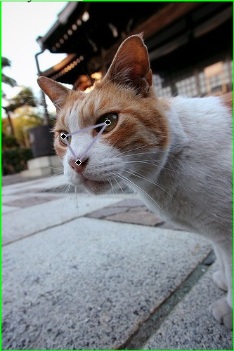
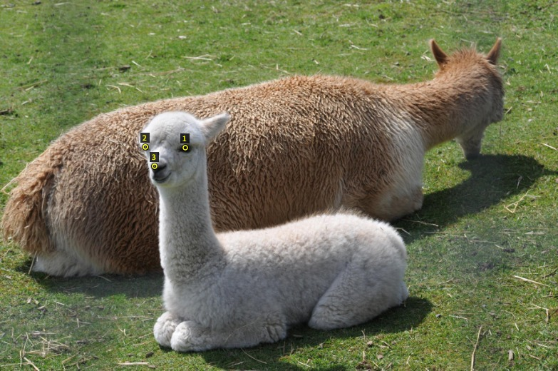
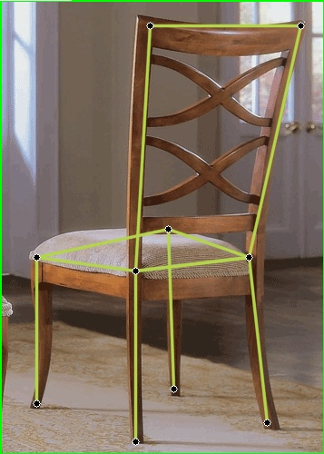

# General-Keypoint-Detection
## 1. Introduction
- This is the source code implementation for the ECCV 2026 paper [GKDT: General Keypoint Detection Transformer](https://arxiv.org/pdf/2607.00752)
- The major contributions of this work are in two aspects: 1) We present ***a powerful yet highly practical foundation model, called GKDT, to handle general keypoint detection***. GKDT supports visual prompt, text prompt, and both, enabling few-shot, zero-shot, and multimodal prompted detection. GKDT is open-world, thus it also supports continual learning on new categories. To our best knowledge, GKDT is the first DINOv3 based model for general keypoint detection (GKD); 2) We present ***a large-scale high-quality dataset MegaKPT that unifies 29 public datasets with over 1.3 million object instances*** for the research of general keypoint detection.
- The source codes, models, and dataset are free for academic research, while commercial use is prohibited. Please cite our paper if you find them helpful, thank you!

<!-- # We are working on releasing the dataset, models, and codes. We will release them within 1~2 weeks. Thanks for your patience and stay tuned! (2026.07.15) -->


## 2. Released GKDT Models
We release two sets of GKDT models. One is trained using the entire MegaKPT dataset (including training, validation and/or test sets of each component dataset) to pursue great performance for real-world testing and applications; Another set is only trained by the combination of training sets of each component dataset for the purpose of research. The model variants GKDT-L (default model in our paper) and GKDT-H use the DINOv3-L and DINOv3-H visual backbones, respectively.
 
### 2.1 For real-world testing & application
Results across 22 datasets' test sets with 1000 episodes and metric PCK@0.1:
|        |Prompt|Animal|AwA  |CUB  |NABird|AP-10K|Vinegar fly|Locust|Mourse5k|Macaque|Tiger|Animal Kin.|COCO val|HumanArt|300W |Ani.Web|OneHand|HInt |Keypoint-5|CarFusion|D.Fashion2|Cephalo|Hand X-ray|
|--------|:----:|:----:|:---:|-----|:----:|:----:|:---------:|:----:|:------:|:-----:|:---:|:---------:|:------:|:------:|:---:|:-----:|:-----:|:---:|:--------:|:-------:|:--------:|:-----:|:--------:|
|GKDT-L  |visual|89.13 |94.84|98.79|97.99 |95.52 |99.42      |99.32 |98.46   |91.45  |95.86|96.70      |90.59   |88.93   |98.52|95.28  |97.77  |88.85|97.46     |97.51    |91.19     |99.98	 |100.00    |
|        |text  |94.02 |97.08|99.34|98.27 |96.78 |99.89      |99.80 |98.55   |95.05  |97.75|97.74      |94.46   |94.32   |99.76|97.47  |98.90  |94.26|98.62     |98.13    |95.31     |99.98	 |100.00    |
|        |both  |93.12 |96.80|99.28|98.24 |96.50 |99.86      |99.74 |98.56   |94.62  |97.56|97.62      |94.51   |93.70   |99.68|97.42  |98.73  |93.45|98.42     |97.91    |94.64     |99.98	 |100.00    |
|GKDT-H  |visual|92.10 |95.69|99.22|98.85 |97.32 |99.56      |99.33 |98.72   |91.97  |97.03|98.42      |92.33   |91.20   |99.13|96.79  |98.39  |93.63|98.52     |98.17    |91.24     |100.00 |100.00    |
|        |text  |95.48 |98.49|99.56|99.04 |98.29 |99.95      |99.74 |98.76   |95.88  |98.34|98.96      |95.56   |96.03   |99.93|98.81  |99.36  |97.05|99.16     |98.80    |95.56     |100.00 |100.00    |
|        |both  |94.73 |98.21|99.52|99.04 |98.09 |99.94      |99.67 |98.74   |95.54  |98.20|98.90      |95.54   |95.59   |99.85|98.77  |99.25  |96.54|99.12     |98.58    |94.54     |100.00 |100.00    |

Download for applications: [GKDT-L](https://huggingface.co/changshenglu/GKDT-L_for_App/tree/main) | [GKDT-H](https://huggingface.co/changshenglu/GKDT-H_for_App/tree/main)

### 2.2 For research
Results across 22 datasets' test sets with 1000 episodes and metric PCK@0.1:
|        |Prompt|Animal|AwA  |CUB  |NABird|AP-10K|Vinegar fly|Locust|Mourse5k|Macaque|Tiger|Animal Kin.|COCO val|HumanArt|300W |Ani.Web|OneHand|HInt |Keypoint-5|CarFusion|D.Fashion2|Cephalo|Hand X-ray|
|--------|:----:|:----:|:---:|-----|:----:|:----:|:---------:|:----:|:------:|:-----:|:---:|:---------:|:------:|:------:|:---:|:-----:|:-----:|:---:|:--------:|:-------:|:--------:|:-----:|:--------:|
|GKDT-L  |visual|81.11 |84.64|97.71|96.25 |89.25 |97.59      |98.66 |96.40   |88.82  |92.33|90.74      |88.64   |82.92   |96.99|82.54  |92.56  |69.79|83.01     |94.15    |90.96     |99.46  |99.28     |
|        |text  |73.27 |92.80|98.58|96.94 |91.93 |98.91      |99.49 |97.37   |93.75  |95.88|93.77      |93.59   |90.48   |99.04|86.36  |95.36  |82.64|88.15     |96.25    |95.34     |99.49  |99.62     |
|        |both  |76.87 |91.14|98.48|96.86 |91.50 |98.79      |99.37 |97.29   |93.15  |95.40|93.29      |93.52   |89.68   |98.87|86.24  |95.12  |81.13|87.04     |95.92    |94.58     |99.49  |99.60     |
|GKDT-H  |visual|81.73 |87.26|97.89|96.79 |90.16 |97.88	     |98.69 |96.38   |89.25  |92.83|92.45      |90.14   |84.33   |97.36|83.48  |94.00  |70.54|82.69     |95.37    |90.97     |99.63  |99.86     |
|        |text  |74.01 |93.91|98.83|97.20 |92.53 |99.11      |99.49 |96.68   |94.09  |96.32|95.13      |94.15   |91.51   |99.35|87.63  |96.41  |83.47|88.50     |96.90    |95.77     |99.73  |99.90     |
|        |both  |76.62 |92.57|98.73|97.14 |92.02 |99.01      |99.38 |96.61   |93.52  |95.85|94.69      |94.18   |90.81   |99.12|87.43  |96.14  |82.16|87.51     |96.51    |94.96     |99.72  |99.92     |

Download for research: [GKDT-L](https://huggingface.co/changshenglu/GKDT-L_for_Research/tree/main) | [GKDT-H](https://huggingface.co/changshenglu/GKDT-H_for_Research/tree/main)


## 3. Environment Setup
Our codes rely minimal dependancy on other python packages such as pytorch and opencv. Please follow below four steps strictly to steup the environment:

Step 1: Create a virtual environment (let us assume `gkd_env`) in anaconda.
```
conda create --name gkd_env python=3.10.4
```

Step 2: Ensure there is an GPU in your computer with the CUDA toolkit installed.

Step 3: Activate `gkd_env`, and install [pytorch](https://pytorch.org/get-started/previous-versions/) (compatible to your GPU devices) and opencv. In this example, I install pytorch for CUDA version 11.8
```
conda activate gkd_env
pip3 install torch==2.7.0 torchvision==0.22.0 torchaudio==2.7.0 --index-url https://download.pytorch.org/whl/cu118
pip3 install opencv-contrib-python
```

Step 4: Install other packages listed in `requirements.txt`
```
pip3 install -r requirements.txt
``` 

Now you should have one working environment! 

If you met `ModuleNotFoundError: No module named 'pkg_resources'`, lower setuptools version by `pip3 install setuptools==78.1.1`. Everything should be fine.


## 4. Real-World Testing & Applications

### 4.1 Download Models
Assume the path of current working directory is `General-Keypoint-Detection/`:

- Download the [GKDT-L model](https://huggingface.co/changshenglu/GKDT-L_for_App/tree/main) and put it to `output/GKDT-L_for_app/model/gkd_fullset.best`

- Go to folder `test_real_world/object_detor_lib/weights`, and then download open-set object detectors [Grounding DINO](https://github.com/idea-research/groundingdino) and [Locate Anything](https://github.com/NVlabs/Eagle/tree/main/Embodied) by
```
wget -q https://github.com/IDEA-Research/GroundingDINO/releases/download/v0.1.0-alpha/groundingdino_swint_ogc.pth
git lfs install
git clone https://huggingface.co/nvidia/LocateAnything-3B
```
Note that object detectors are only used in multi-object GKD scenario. If you only do single-object GKD, object detectors are no need to download.

Now the project layout should look like as follows:
```
|-- General-Keypoint-Detection
|   |-- core/
|   |-- datasets/
|   |-- evaluation_metric/
|   |-- evaluation_related/
|   |-- experiments/
|   |-- MegaKPT/
|   |-- network/
|   |-- output/
|   |   |-- GKDT-L_for_app/
|   |   |   |-- model/
|   |   |   |   |-- gkd_fullset.best
|   |-- test_real_world/
|   |   |-- configs/
|   |   |-- gkd_inference_lib/
|   |   |-- object_detor_lib/
|   |   |   |-- groundingdino/
|   |   |   |-- weights/
|   |   |   |   |-- LocateAnything-3B
|   |   |   |   |-- groundingdino_swint_ogc.pth
|   |   |-- scripts/
|   |   ...
|   |-- utils/
|   ...
```

### 4.2 Single-object General Keypoint Detection
Some detection examples are shown in `test_real_world/scripts/eval_single_obj_gkd.sh`. The meaning of input parameters are detailed in `test_real_world/single_obj_gkd_inference.py`.

Below we demonstrate some examples for single-object GKD. Please navigate to the path of `General-Keypoint-Detection/`.


**Example 1: Visual prompted detection**
```
python3 test_real_world/single_obj_gkd_inference.py \
    --cfg_file test_real_world/configs/gkd.yaml \
    --checkpoint output/GKDT-L_for_app/model/gkd_fullset.best \
    --input_im test_real_world/ims1/2007_007524.jpg \
    --support_im test_real_world/ims1/2007_003778.jpg \
    --support_kps 343 166 281 158 311 197 \
    --skeleton 1 2 1 3 2 3
```
Given visual prompt (i.e., support image with marked left eye, right eye and nose keypoints), the detection result is

<table>
  <tr>
    <td align="center">
      
    </td>
    <td align="center">
      
    </td>
  </tr>
</table>


**Example 2: Text prompted detection**

Detect keypoints in the window of entire image:
```
python3 test_real_world/single_obj_gkd_inference.py \
    --cfg_file test_real_world/configs/gkd.yaml \
    --checkpoint output/GKDT-L_for_app/model/gkd_fullset.best \
    --input_im test_real_world/ims1/2007_007524.jpg \
    --kps_texts 'nose' 'left eye' 'right eye' 'left ear' 'right ear' \
    --skeleton 1 2 1 3 2 3 2 4 3 5
```
Or detect keypoints in an ROI:
```
python3 test_real_world/single_obj_gkd_inference.py \
    --cfg_file test_real_world/configs/gkd.yaml \
    --checkpoint output/GKDT-L_for_app/model/gkd_fullset.best \
    --input_im test_real_world/ims1/2007_007524.jpg \
    --bbox_on_input_im 33 38 241 310 \
    --kps_texts 'nose' 'left eye' 'right eye' 'left ear' 'right ear' \
    --skeleton 1 2 1 3 2 3 2 4 3 5
```
Given text prompts `nose, left eye, right eye, left ear, right ear`, the detection results are:

<table>
  <tr>
    <td align="center">
      
    </td>
    <td align="center">
      
    </td>
  </tr>
</table>


**Example 3: Multimodal prompted detection**
```
python3 test_real_world/single_obj_gkd_inference.py \
    --cfg_file test_real_world/configs/gkd.yaml \
    --checkpoint output/GKDT-L_for_app/model/gkd_fullset.best \
    --input_im test_real_world/ims1/2007_007524.jpg \
    --kps_texts 'left eye' 'right eye' 'nose' \
    --support_im test_real_world/ims1/2007_003778.jpg \
    --support_kps 343 166 281 158 311 197 \
    --skeleton 1 2 1 3 2 3
```


**Example 4: Cross-object prompted detection**
```
python3 test_real_world/single_obj_gkd_inference.py \
    --cfg_file test_real_world/configs/gkd.yaml \
    --checkpoint output/GKDT-L_for_app/model/gkd_fullset.best \
    --input_im test_real_world/ims1/2007_007524.jpg \
    --kps_texts 'left eye' 'right eye' 'nose' \
    --support_im test_real_world/ims1/alpaca_150.jpg \
    --support_kps 615 495 483 493 521 549
```

<table>
  <tr>
    <td align="center">
      
    </td>
    <td align="center">
      
    </td>
  </tr>
</table>


**Example 5: Detection using predefined names**

Detect keypoints on chair image
```
python3 test_real_world/single_obj_gkd_inference.py \
    --cfg_file test_real_world/configs/gkd.yaml \
    --checkpoint output/GKDT-L_for_app/model/gkd_fullset.best \
    --input_im test_real_world/ims1/00000016.jpg \
    --obj_type 'chair' 
```

Detect keypoints on hand x-ray image
```
python3 test_real_world/single_obj_gkd_inference.py \
    --cfg_file test_real_world/configs/gkd.yaml \
    --checkpoint output/GKDT-L_for_app/model/gkd_fullset.best \
    --input_im test_real_world/ims1/3144.png \
    --obj_type 'hand_xray' 
```

<table>
  <tr>
    <td align="center">
      
    </td>
    <td align="center" width="50%">
      
    </td>
  </tr>
</table>

You can also enrich the predefined keypoint texts in `test_real_world/predefined_keypoints.py` by yourselves!


### 4.3 Multi-object General Keypoint Detection


## 5. MegaKPT Dataset


## 6. Model Training and Evaluation


## 7. Citation
```
@inproceedings{lu2026gkdt,
  title={GKDT: General Keypoint Detection Transformer},
  author={Lu, Changsheng and Chen, Yuxin and Gui, Haokun and Wang, Rong and Yang, Jie and Yang, Harry and Hengel, Anton van den and Jia, Jiaya},
  booktitle={European Conference on Computer Vision},
  year={2026},
  organization={Springer}
}
@inproceedings{lu2024openkd,
  title={Openkd: Opening prompt diversity for zero-and few-shot keypoint detection},
  author={Lu, Changsheng and Liu, Zheyuan and Koniusz, Piotr},
  booktitle={European Conference on Computer Vision},
  pages={148--165},
  year={2024},
  organization={Springer}
}
@inproceedings{lu2022few,
  title={Few-shot keypoint detection with uncertainty learning for unseen species},
  author={Lu, Changsheng and Koniusz, Piotr},
  booktitle={2022 IEEE/CVF Conference on Computer Vision and Pattern Recognition (CVPR)},
  pages={19394--19404},
  year={2022},
  organization={IEEE}
}
```
